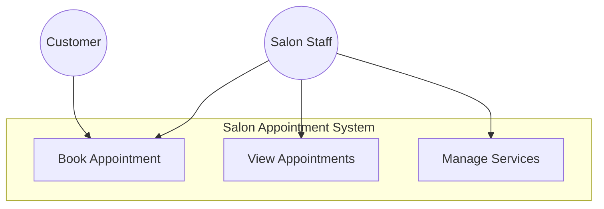

# Salon Appointment System
## Project Documentation

### 1. Use Case Diagram Description

#### Primary Actors:
- **Customer**: The person booking an appointment
- **Salon Staff**: Employee managing appointments

#### Use Cases:

1. **Book Appointment**
   - Actor: Customer/Salon Staff
   - Description: Create a new appointment booking
   - Pre-conditions: System is available
   - Main Flow:
     - Enter customer details
     - Select service
     - Choose date and time
     - Confirm booking
   - Post-conditions: Appointment is saved in system

2. **View Appointments**
   - Actor: Salon Staff
   - Description: View list of all appointments
   - Pre-conditions: Appointments exist in system
   - Main Flow:
     - Navigate to appointments tab
     - View appointment details
   - Post-conditions: None

3. **Manage Services**
   - Actor: Salon Staff
   - Description: Maintain list of available services
   - Pre-conditions: Staff has access
   - Main Flow:
     - Initialize available services
     - Set pricing
   - Post-conditions: Services list is updated



### 2. ER Diagram and Relational Schema

#### Entities:

1. **Customer**
   - CustomerID (PK)
   - Name
   - PhoneNumber

2. **Service**
   - ServiceID (PK)
   - Name
   - Price

3. **Appointment**
   - AppointmentID (PK)
   - CustomerID (FK)
   - ServiceID (FK)
   - DateTime
   - Status

#### Relational Schema:

```sql
Customer (
    CustomerID INT PRIMARY KEY,
    Name VARCHAR(100) NOT NULL,
    PhoneNumber VARCHAR(15) NOT NULL
)

Service (
    ServiceID INT PRIMARY KEY,
    Name VARCHAR(50) NOT NULL,
    Price DECIMAL(10,2) NOT NULL
)

Appointment (
    AppointmentID INT PRIMARY KEY,
    CustomerID INT FOREIGN KEY REFERENCES Customer(CustomerID),
    ServiceID INT FOREIGN KEY REFERENCES Service(ServiceID),
    DateTime DATETIME NOT NULL,
    Status VARCHAR(20) DEFAULT 'Scheduled'
)
```

### 3. Windows Form Design

#### Current Implementation:
The application uses a tab-based interface with two main sections:

1. **Book Appointment Tab**
   - Customer Name input
   - Phone Number input
   - Service selection dropdown
   - Date and Time picker
   - Book Appointment button

2. **View Appointments Tab**
   - ListView displaying all appointments
   - Columns: Customer Name, Phone, Service, Date & Time

#### Suggested UI Improvements:
1. Add appointment status indicators
2. Include appointment editing capabilities
3. Add appointment deletion functionality
4. Implement search/filter for appointments
5. Add service management interface
6. Include data validation feedback
7. Add confirmation dialogs

### 4. Implementation Recommendations

1. **Data Persistence**
```csharp
// Add database context
public class SalonDbContext : DbContext
{
    public DbSet<Customer> Customers { get; set; }
    public DbSet<Service> Services { get; set; }
    public DbSet<Appointment> Appointments { get; set; }
}
```

2. **Input Validation**
```csharp
private bool ValidatePhoneNumber(string phone)
{
    return Regex.IsMatch(phone, @"^\d{10}$");
}

private bool ValidateAppointmentTime(DateTime dateTime)
{
    return dateTime > DateTime.Now && 
           !appointments.Any(a => a.DateTime == dateTime);
}
```

3. **Appointment Management**
```csharp
public void UpdateAppointment(int id, Appointment updatedAppointment)
{
    var appointment = appointments.FirstOrDefault(a => a.Id == id);
    if (appointment != null)
    {
        appointment.CustomerName = updatedAppointment.CustomerName;
        appointment.PhoneNumber = updatedAppointment.PhoneNumber;
        appointment.Service = updatedAppointment.Service;
        appointment.DateTime = updatedAppointment.DateTime;
        RefreshAppointmentList();
    }
}
```

### 5. Testing Strategy

1. **Unit Tests**
   - Input validation
   - Appointment booking logic
   - Time slot availability

2. **Integration Tests**
   - Database operations
   - UI interactions
   - End-to-end booking flow

3. **User Acceptance Testing**
   - Booking process
   - Appointment management
   - Service management

### 6. Future Enhancements

1. Customer authentication system
2. Email/SMS notifications
3. Staff scheduling
4. Payment integration
5. Reporting and analytics
6. Mobile application
7. Online booking portal

